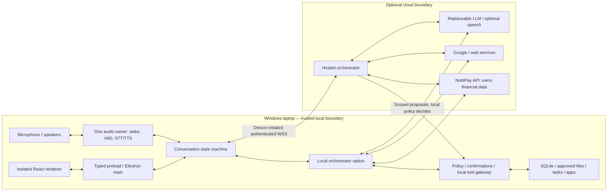

# Astra Renovation Plan — Vezora AI

Audit date: 16 September 2026. Scope: current `astra-renovation` checkout and read-only inspection of `D:\Vezora\Nottipay`. This is a proposal, not an implementation record. Phase 1 requires the user's approval.

Current implementation status: see PHASE1_REPORT.md. The approved £0/month constraint at the end governs all future infrastructure choices.

## Evidence and limits

`VEZORA_PROJECT_CONTEXT.md` was read and checked against source, imports, route mounting, callers and lockfiles. Its outdated Git observations were disregarded. Vezora was clean on `astra-renovation`, tracking `origin/astra-renovation`, at `a2fda32` before this document. NottiPay was clean on its existing `main`. No branch switch, fetch, commit, push or NottiPay mutation was performed during the audit.

The inventory contains 186 tracked files, including 110 JavaScript/TypeScript source files. Generated dependencies and release contents were excluded from architectural analysis, except a presence-only check for sensitive packaged files. Secret values and private database contents were not read into this report.

- All 64 tracked JavaScript files passed `node --check`.
- Static relative-import checks identified two missing imports in legacy `backend/test-hybrid-system.js`: `services/memoryService.pg.js` and `services/retrievalService.vector.js`.
- TypeScript and ESLint could not run because their local executables were missing. Dependencies were not installed. No successful typecheck, lint, build or end-to-end test is claimed.
- No live OAuth, financial, model or audio requests were executed. Code presence does not prove a working deployed integration.
- Windows reports an AMD Ryzen 7 260 with Radeon 780M, 8 cores/16 threads, and NVIDIA RTX 5050 Laptop GPU. Installed Node is v24.19.0. Available RAM/VRAM, compatible CUDA runtime, microphone quality and inference latency remain unverified.

## A. Current Vezora architecture

Vezora is an Electron-hosted React/Vite application with a local Express backend. Useful chat, task, file, memory and Google integration code exists, but several generations coexist. It is not yet a reliable continuous room assistant or secure remotely accessible agent.

### Stack and map

Lockfile-resolved versions include React 19.2.3, Vite 7.3.1, TypeScript 5.9.3, Electron 30.5.1, electron-builder 24.13.3, Express 4.22.1, better-sqlite3 9.6.0, groq-sdk 0.37.0, Zod 4.3.6 and @langchain/core 1.1.19. Other active libraries include Tailwind, Framer Motion, dnd-kit, React Markdown, googleapis, node-cron, ws, Tesseract.js and Voyage. PostgreSQL migration files and installed SQLCipher packages do not make the active database PostgreSQL or encrypted SQLite.

```text
main.js                         Electron lifecycle and backend process launch
package.json                    Vite/Electron scripts and installer packaging
src/main.tsx, App.tsx            React bootstrap, providers and view switching
src/pages/                      Current chat/tasks/files/memory/settings/auth views
src/hooks/                      localStorage conversations and browser voice hooks
src/contexts/                   UI context and localStorage authentication
src/components/                 Current controls mixed with older unused panels
backend/index.js                 Express, route mounts, cron and stub voice WS
backend/routes/                 HTTP endpoints, including competing chat paths
backend/core/                   Tools, permissions and LLM/context helpers
backend/services/               Coordinator, SQLite services, retrieval, TTS, workflows
backend/utils/                  Database, providers, Google tokens, JWT, old agent
backend/controllers/            Files/apps/settings/logs/legacy memory
backend/migrations/             PostgreSQL/vector-era SQL, not active SQLite migrations
backend/test-*.js                Manual/legacy scripts, not a regression suite
start-vezora.bat                 Windows Ollama/backend/Electron launcher
VEZORA_PROJECT_CONTEXT.md        Earlier reconstruction requiring source verification
```

### Major execution flows

**Desktop:** `main.js` starts external `node backend/index.js`, waits two seconds, and loads Vite on port 5173 or `dist/index.html`. `SKIP_ELECTRON_BACKEND` avoids duplication in the batch launcher. There is no preload bridge, tray, global hotkey, single-instance handling or independent background wake service. BrowserWindow enables Node integration and disables context isolation.

**Typed chat:** `ChatPage.tsx` -> `useChats.ts` localStorage -> `/api/chat` in `routes/chat.js` -> optional authentication -> Ollama/Gemini availability gate -> heuristic registry tools, Google keyword branch or `coordinatorService.js` -> Groq classification, task/web/retrieval work, prompt construction and model generation -> full JSON -> UI and optional speech. The gate can reject Groq requests and local tools when Ollama is unavailable; Gemini initialization is commented out. Tool failures can fall through into a normal answer.

**Provider/context:** Groq, normally `llama-3.3-70b-versatile`, and Ollama are active. `llmRouter.js` supplies another fallback path and waits on Ollama health unnecessarily. The coordinator constructs its own prompt; `core/prompts.js` is not the controlling source. The current message can appear twice because the UI includes it in history and the coordinator appends it. Computed compact context is not supplied to the main model path. Groq history is flattened into text; registry schemas are not sent as native provider tool definitions. Coordinator calls can override Ollama's low default output limit, so it is not a universal 100-token cap.

**Alternate chat:** unauthenticated `/api/chat/stream` uses another SSE path that bypasses the main coordinator/registry and is not the current renderer transport. Converge these paths before expanding features.

**Voice:** `useVoice.ts` wraps browser Web Speech with restart logic. `useVoiceCall.ts` stops recognition during processing, sends a full request, fetches a complete TTS blob, plays it, then resumes. `ttsService.js` starts Piper per request and generates a complete WAV before serving it. HTTP file streaming is not incremental synthesis. The voice WebSocket is a stub. Page-level STT wake-phrase matching is not independent offline wake detection.

**Tasks/memory:** UI and coordinator use SQLite task/memory services. Writes can wait for remote embeddings. Embeddings are JSON arrays scored in application code. Tasks poll every 30 seconds. Conversations persist only in browser localStorage under keys not scoped to the signed-in user. Legacy JSON memory and settings/logs/workflow files coexist.

**Google:** OAuth stores a global token file. Gmail/Calendar routes exist; keyword-selected `langchainAgent.js` handles some commands. That branch lowercases input, requires Google login for some ordinary calendar-related language, and does not consistently construct required arguments. Credentials are not bound to the requesting Vezora user.

**Files/apps/workflows:** legacy routes and tools reach controllers through different gates; cron workflow steps call controllers directly. File search lists directory entries rather than indexed content. App launch can fall back to arbitrary shell command construction.

| System | Current state |
|---|---|
| React desktop, text chat, task CRUD | Implemented code paths; runtime regression checks still required |
| SQLite users/profile/tasks/memory | Active; migration, isolation and retrieval defects |
| Login/register | Implemented; unsafe token/route boundaries |
| Files/apps | Implemented subset; unsafe to expose remotely |
| Google mail/calendar | Partial; ownership and confirmation gaps |
| Web research | Tavily/Jina path exists; separate Gemini path stale |
| Voice/TTS | Partial; sequential and not cancellable/duplex |
| Independent wake/tray/startup | Not implemented |
| Workflows/reminders | Partial cron systems; ownership and bypass defects |
| OCR | Images implemented; PDF returns 501; unbounded batch concurrency |
| Native model tool calling | Not connected to active provider requests |
| NottiPay / secure cloud gateway | Not present |

Sixteen components have no incoming imports in the checked graph: CalendarPanel, CameraInput, ContextVisualization, EmailPanel, EnhancedAppLauncher, FileUpload, NotificationCenter, OnboardingTutorial, PrivacyDashboard, SearchResults, SettingsPanel, Sidebar, SuggestionsWidget, VoiceCallMode, WakeWordDetector and WorkflowBuilder. MemoryPanel is reachable only through unused Sidebar. These are review candidates, not permission to delete them. Old PostgreSQL tests/migrations do not describe current SQLite architecture.

## B. Target architecture

Keep Electron, React and useful existing business services. Introduce one orchestrator and one authorization/execution path, not a multi-agent framework. Local code owns devices, data access and final authorization; cloud services supply replaceable reasoning and optional hosting without general Windows access.

1. **Desktop host:** trusted Electron main process, narrow typed preload IPC, window/tray/hotkeys, secrets and service supervision. Disable renderer Node integration and enable context isolation.
2. **Local companion:** wake/audio/local STT/TTS, SQLite, tasks, approved file index and tool gateway. Prefer IPC or protected local transport. If HTTP remains temporarily, bind loopback and require a per-launch credential and origin checks; loopback alone is not authentication.
3. **Orchestrator:** provider-neutral conversation/tool loop with budgets, cancellation and typed events. Initially run locally using cloud LLM APIs; deploy the bounded interface later if useful. Local mode must remain available.

Proposed logical layout, introduced incrementally rather than by mass relocation:

```text
desktop/main/             lifecycle, tray, hotkeys, supervision, safeStorage
desktop/preload/          small versioned IPC surface
desktop/audio/            capture/output host and AudioWorklet transport
local/audio/             wake/VAD/STT/TTS adapters and inference worker
local/storage/           SQLite migrations, conversations, tasks, memories
local/files/             approved roots, indexing, bounded operations
local/gateway/           capabilities, confirmations, execution receipts
backend/orchestration/   single turn loop and context builder
backend/providers/       LLM and optional cloud speech adapters
backend/integrations/    Google, web, NottiPay clients
backend/transport/       HTTP/streaming/optional cloud connection
shared/contracts/        schemas, events, identity, errors
src/                     existing React UI using those contracts
tests/                   policy, integration, desktop, audio, packaging
```

These are module boundaries, not a microservice per directory. Keep a small number of supervised processes. Use a Python inference worker only if benchmarks justify the distribution cost; evaluate ONNX/native alternatives for packaging simplicity.

## C. Local versus cloud diagram



No inbound router port or remote shell. Cloud disconnection must not disable local wake, typed input, allowlisted apps, task reads or local search. A sleeping/off laptop cannot run its wake engine: waking the UI means showing an already-running app on an awake machine. Windows can restrict forced foreground focus; provide a notification/focus fallback.

## D. Voice architecture

Capture must survive ChatPage unmounting and a hidden window. One managed audio host owns the microphone, requests supported acoustic echo cancellation and supplies bounded PCM frames to VAD/wake/STT. Validate actual Electron/device behavior instead of assuming an audio constraint guarantees echo removal.

State machine: `idle -> listening -> thinking -> speaking`, with explicit `interrupted`, `awaiting_confirmation`, `recovering` and `muted` transitions. Wake opens a configurable follow-up window, initially around 30 seconds. Preserve manual hotkey and typed controls.

1. Detect the wake phrase locally using an in-memory pre-roll; no ambient recording retention by default.
2. Immediately signal listening and show/focus the window where permitted.
3. VAD/STT produce partial captions. Only finalized utterances can authorize actions.
4. Stream model text/tool status with conversation, turn and generation IDs.
5. Synthesize bounded PCM chunks at suitable clause boundaries while later text arrives. Never speak success before execution succeeds.
6. Keep VAD active during playback with echo control. Interruption stops output, flushes queues, aborts model/speech work and invalidates old-generation events.
7. Preserve completed tool receipts and the speech actually played. Cancellation cannot undo an already completed external write.

Every request, worker job and playback promise needs cancellation and cleanup. Current detached fetches and the 45-second watchdog can cause overlapping turns or speech after hangup. Mute controls capture; end-call invalidates the session. Release audio URLs, streams and worker handles deterministically.

Voice in a room is not strong identity verification. High-risk actions require authenticated UI confirmation, not a spoken “yes” treated as proof of identity. Never perform destructive work from interim transcripts.

Provisional targets, not measurements: wake event to UI acknowledgement p95 under 150 ms; detected barge-in to stopped playback p95 under 150 ms; simple warm response first audio median under 1.2 seconds and p95 under 2 seconds. Measure end-of-speech, endpointing, STT, model first token, first audio and audible output separately. Slow tools get timely status rather than a universal latency promise.

Benchmark UK/Indian English, names/dates/currency, room distance, noise, assistant echo, eight-hour false-wake exposure, cold start, battery mode, concurrent inference and suspend/resume. Measure transcription and slot accuracy, missed wakes, false interruptions, CPU/RAM/VRAM and p50/p95 latency. Wake CPU below roughly 3% is a target to validate, not a claim about this laptop.

## E. STT recommendation and alternatives

**Provisional primary:** local faster-whisper in a persistent worker; choose size/quantization through benchmarks. Start CPU int8 and evaluate supported NVIDIA acceleration. Add VAD and rolling-window/local-agreement logic; its file transcription API alone is not conversational streaming. GPU compatibility and VRAM remain unverified.

| Option | Role and tradeoff |
|---|---|
| faster-whisper | Local-first, no per-minute fee; packaging and endpointing work |
| Deepgram Flux | Opt-in cloud conversation mode with turn events; metered audio egress |
| Deepgram Nova-3 streaming | Cloud alternative when endpointing is controlled locally |
| sherpa-onnx streaming ASR | Alternative local runtime; model/accuracy evaluation required |
| Browser Web Speech | Compatibility fallback only; limited support, potentially server-backed |

Choose cloud speech by explicit user preference after accuracy/latency comparison. Typed input is the dependable fallback. Never silently upload ambient audio because local inference fails.

Sources: [faster-whisper](https://github.com/SYSTRAN/faster-whisper), [Flux](https://developers.deepgram.com/docs/flux/quickstart), [sherpa-onnx](https://github.com/k2-fsa/sherpa-onnx), [Web Speech limitations](https://developer.mozilla.org/en-US/docs/Web/API/SpeechRecognition).

## F. TTS recommendation and alternatives

**Provisional primary:** warm local Kokoro, with ONNX evaluated for Windows packaging. Test CPU inference first to avoid unnecessary STT GPU contention. The 82M model has Apache-2.0 weights; separately check runtime/voice/dependency licenses. Naturalness and latency on this laptop are not measured.

| Option | Role and tradeoff |
|---|---|
| Kokoro | Proposed local default after benchmark; additional model/runtime packaging |
| Existing Piper | Transitional lightweight fallback; remove per-request process/WAV buffering |
| Cartesia Sonic | Optional paid streaming; WebSocket contexts/cancellation and usage costs |
| ElevenLabs Flash/Turbo | Premium alternative; vendor latency is not measured end-to-end latency |
| OpenAI gpt-4o-mini-tts | Replaceable streaming cloud alternative; metered tokens |
| Installed Windows voice/text | Last fallback; verify local voice availability |

Use bounded PCM queues and immediate cancellation. Existing Piper binary version/provenance is unverified. The maintained Piper repository is GPL-3.0; review redistribution and individual voice licenses before shipping.

Sources: [Kokoro](https://huggingface.co/hexgrad/Kokoro-82M), [Kokoro ONNX](https://github.com/thewh1teagle/kokoro-onnx), [Piper](https://github.com/OHF-Voice/piper1-gpl), [Cartesia streaming](https://docs.cartesia.ai/api-reference/tts/websocket), [OpenAI speech guide](https://developers.openai.com/api/docs/guides/text-to-speech).

## G. Wake-word recommendation

**Provisional primary:** sherpa-onnx keyword spotting for “Hey Zara,” subject to model licensing, pronunciation/tokenization and false-positive tests. Keyword configuration and Windows Node support make it a reasonable no-required-subscription candidate. Keep inference outside the UI and verify native/runtime compatibility.

**Alternative:** openWakeWord with a trained custom phrase. Bundled “hey jarvis” is not “Hey Zara.” Code is Apache-2.0, but pretrained models use CC-BY-NC-SA-4.0 restrictions; model provenance matters.

**Conditional option:** Porcupine supports Windows Node/custom keywords, but current Picovoice documentation does not offer dedicated free or paid personal/noncommercial plans. A trial is not a sustainable free personal deployment assumption. Resolve licensing before selection.

Sources: [sherpa KWS](https://k2-fsa.github.io/sherpa/onnx/kws/index.html), [Windows Node](https://k2-fsa.github.io/sherpa/onnx/javascript-api/install.html), [openWakeWord](https://github.com/dscripka/openWakeWord), [Porcupine](https://picovoice.ai/docs/quick-start/porcupine-nodejs/), [Picovoice FAQ](https://picovoice.ai/docs/faq/general/).

## H. Memory and retrieval redesign

Keep SQLite as local source of truth; a separate vector database is not currently justified. Introduce versioned transactional migrations and consistent backup/restore before changing records.

Separate working conversations (ordered messages, tool receipts, partial/interrupted completion and bounded summaries), durable memories (stable IDs/type/key/value, provenance, confidence, timestamps and ownership), structured tasks/profile, and an approved-root document index (file hashes, bounded chunks, source references and embedding versions). Assistant-generated statements must not automatically become facts about the user.

Use lexical/FTS retrieval first, optionally combined with background embeddings. Confirm FTS5 in the shipped SQLite build. Keep indexing out of task-write latency. Apply relevance thresholds, deduplication and token budgets; do not mix embedding models/dimensions. Remote embedding is a separate egress choice: permission to read a file locally does not authorize sending it to a cloud model.

Repair current identity/shape mismatches: memory deduplication searches for a different key representation than the stored data; preference rendering expects fields different from extraction output; MemoryPage sends an ID to a key-based deletion API; type filtering is ignored; vector retrieval lacks a relevance threshold; fallback task results duplicate; normal task payloads include embeddings. Daily-summary code expects fields retrieval does not return.

Migrate existing data additively, with tested imports and user choice about legacy JSON. Do not silently merge browser histories belonging to different users. Forgetting removes related chunks/embeddings and invalidates cached context. Never persist a second NottiPay ledger.

## I. Tool and router redesign

Use one contract for UI commands, model calls, shortcuts, cron/workflows and cloud proposals:

`authenticated identity -> schema validation -> capability/risk policy -> preview/confirmation -> executor -> durable receipt -> response`

Every tool declares input/output schemas, scopes, location, risk, timeout, cancellation, idempotency/retry policy and audit fields. Export JSON Schema using supported Zod 4 APIs; current `_def.shape()` introspection is unreliable. Provider adapters translate a shared protocol into native model/tool requests. Keep Groq and Ollama available; an expensive replacement model is not required.

Deterministic shortcuts must use the same executor. Ambiguous tasks/files/accounts require disambiguation, not low-threshold fuzzy deletion. Bound tool rounds, turn duration, context size and external spend. Report failed execution truthfully rather than falling through to a normal answer.

| Risk | Examples | Policy |
|---|---|---|
| 0 | Scoped task list or approved local search | Authenticated capability; separate egress restriction |
| 1 | Add task, benign allowlisted app, explicitly requested bounded expense | Clear intent and bounded policy; clarify ambiguity |
| 2 | Overwrite/move file, send email, update calendar, edit expense | Exact preview and single-use confirmation |
| 3 | Delete, execute unknown document/script, high-impact finance | Strong UI confirmation or disallow unsupported operation |

Opening documents can execute code: classify extension/handler and path. Memory forgetting is destructive. Avoid a general shell tool; use named, validated OS handlers.

Confirmation grants bind user, device, session, tool, canonical validated argument hash, expiry and nonce. Only the trusted UI may approve them. Consume atomically; prevent replay. Any failed/expired/mismatched grant stops execution. Cloud proposals never bypass local policy. Retry side effects only with idempotency or explicit recovery.

## J. Security changes and defect priorities

### Critical — before enabling more autonomous actions

1. **Permission fail-open:** `core/toolExecutor.js` checks `denied` and `requiresConfirmation` but never requires `allowed === true`. Invalid/expired/mismatched tickets can reach execution. Grants do not bind supplied arguments. Registry risk flags disagree with the separate risky-tools set; isolated checks showed `file.open` and `memory.forget` allowed immediately despite registry flags.
2. **Trust boundary:** renderer Node integration, disabled isolation, backend listening without a loopback host, unauthenticated/optional-auth execution routes and caller-supplied user IDs. CORS is not authentication.
3. **Command exposure:** app launch falls back to shell command construction. Registry/workflow calls bypass route feature flags. A command deny-list cannot secure arbitrary execution.
4. **Packaged private files:** broad overlapping `backend/**/*` packaging includes private content. Presence checks found `release/win-unpacked/resources/backend/.env` and `release/win-unpacked/resources/backend/data`. Do not distribute this artifact. This establishes local inclusion, not public leakage. Replace broad packaging with explicit assets/exclusions and inspect the rebuilt installer. If an affected artifact was shared, assess exposure and rotate affected credentials. No secret values were disclosed here.

### High

- File containment uses string prefixes, allowing sibling-prefix and junction/symlink escapes. Use canonical, boundary-aware approved-root checks, revalidation, bounded reads and safe handling of nonexistent write destinations. Enforce in shared services.
- JWT has a fallback secret and interchangeable access/refresh validation, without durable rotation/revocation. Google tokens are global/plaintext; OAuth state is absent; fallback callback URL disagrees with the mounted route.
- Google writes, coordinator task deletion and workflows bypass consistent confirmation.
- Persistence is not encrypted despite documentation suggesting it. The encryption helper is unused for persistence; its self-test can succeed through plaintext fallback. Protect tokens in OS-backed storage first; separately decide database encryption/recovery requirements.
- Raw chat/mail reaches logs. Untrusted web content enters privileged prompt sections. Redact before storage, represent retrieved text as untrusted data, and enforce tool policy independently of model obedience.
- Voice lacks cancellation, VAD/echo control and duplex behavior; late output can play after hangup.
- Packaging depends on external Node, duplicate backend paths, relative mutable data and unverified native ABI. `electron-is-dev` is imported at runtime but is a development dependency.

### Medium

- Competing chat paths, unnecessary Ollama health gate, duplicate messages, discarded context and inaccurate provider/timing metadata.
- SQLite create-if-missing setup instead of versioned migrations; no deliberate foreign-key/WAL setup. Verify compatibility before changing settings.
- `/tasks/stats` follows the parameterized ID route and can be rejected as an invalid ID; task ordering is local; overdue filtering can default to all tasks.
- Hourly reminders target `default`, not signed-in users, with incomplete timezone/delivery behavior.
- Shared rate limiter is mounted twice on several routes; ordinary UI traffic can consume its budget unexpectedly.
- Embeddings block writes without reliable timeout; vector scoring scans all rows; OCR concurrency is unbounded; file truncation happens after full read.
- dotenv behavior depends on import order/cwd; sample configuration differs from the active stack.

### Low / after behavior is protected

Unused panels, stale docs, PostgreSQL-era scripts, huge UI/coordinator files, duplicate helpers, key-prefix logging and incomplete loading/error states. Establish coverage before removing legacy. No incoming import is evidence for review, not proof that deletion is safe.

## K. NottiPay integration design

NottiPay remains a separate Next.js/Supabase application and financial source of truth. Its package declares Next 15.5.2 and React 19.1 ranges with Supabase SSR/client libraries. Local source was inspected; deployed revision and production schema were not verified.

### Existing APIs and behavior

- Supabase magic-link browser auth, cookie-backed `currentUser()` and `ALLOWED_EMAIL` restriction.
- `/api/transactions` lists owned transactions and creates expenses; transaction handlers edit/delete.
- `/api/accounts`, `/api/profile` and `/api/me` provide related website data. Workspace construction performs user-filtered Supabase queries.
- Schema includes profiles, accounts, transactions, categories, budgets, commitments, employers, shifts, loans, loan events, FX rates and audit events, with ownership/RLS logic.
- Reuse NottiPay parsing and account matching rather than duplicate them inside Vezora.

Existing authentication consumes website cookies, not scoped third-party Bearer tokens. Some unauthenticated endpoints return successful demo-shaped responses. `/api/dashboard` contains fixed example amounts and cannot supply trustworthy live spend totals. `/api/command/confirm` returns an applied-looking draft/demo note without writing the ledger; the website writes through `/api/transactions`.

Creation inserts a transaction and changes balance separately, with compensation on failure. Edits/deletes also use separate updates and do not consistently check balance failures. This is not atomic under concurrency. `client_id` exists but is not a unique, implemented idempotency contract. Some mapped output omits currency. Preserve integer minor units and account currency; never sum GBP and INR as interchangeable amounts.

### Safe incremental entry point

1. Support opening NottiPay and, once suitable authorization exists, read-only access. Explicitly reject unauthenticated/demo results as financial truth.
2. Add a small **NottiPay-owned integration API** reusing existing business logic. Headless delegated access needs scopes/revocation and explicit browser authorization with state and PKCE/one-time device binding, short-lived access and revocable refresh credentials. Protect local credentials with OS storage. Do not scrape website cookies or distribute Supabase service-role keys to Vezora/renderer.
3. Keep spend/timezone/currency calculations in NottiPay. Extract established website rules behind a shared summary API, not a second Vezora implementation.
4. Before writes, implement a NottiPay-owned atomic transaction/balance operation with user-scoped idempotency and ownership checks. A small SQL function/migration and unique constraint may be necessary, but require separately approved scope and website regression tests. Vezora must not access the financial database directly.
5. Expose typed tools for accounts, transaction search, spend summary, add expense and confirmed edits/deletes. Vezora retains only authorization metadata/minimal receipts, not mirrored records. Avoid financial detail in logs by default.

Example: final spoken expense -> typed draft -> NottiPay account/currency validation -> bounded intent/confirmation -> authenticated idempotent request -> committed receipt -> truthful spoken confirmation. A lost response triggers receipt lookup with the same key, not a duplicate expense.

Minimal NottiPay changes are necessary because delegated auth, authoritative summaries and safe retry semantics are missing. They are proposed, not implemented or authorized now. No NottiPay file was changed; future work needs its own branch and explicit scope, not changes directly on its `main`.

## L. Cloud deployment recommendation

Start with local orchestration calling configured remote model/integration APIs. That is already hybrid and requires neither a second computer nor hosting fees. Secure/package the companion before exposing cloud transport.

When hosting is useful, choose a paid Node service on **Render, Frankfurt**, without GPU inference. Documented Starter is $7/month; verify load fits its 512 MB memory. Use an authenticated device-initiated WebSocket with heartbeat, bounded queues, backoff, resume and replay protection. Store minimal server identity/session data; persistent disk or external storage adds cost. Provider secrets belong in server config; desktop credentials remain OS-protected locally.

Railway is an alternative with a $5 Hobby minimum including usage, not unlimited flat-rate hosting. Render free services sleep after inactivity and are unsuitable for predictable room-assistant latency.

Current Vercel docs describe WebSocket support in beta, bounded by function duration. The older blanket claim that Vercel cannot support WebSockets is no longer appropriate; a long-running Node host remains simpler here. NottiPay can retain its independent deployment.

Sources: [Render pricing](https://render.com/pricing), [regions](https://render.com/docs/regions), [WebSockets](https://render.com/docs/websocket), [free limits](https://render.com/docs/free), [Railway](https://railway.com/pricing), [Vercel WebSockets](https://vercel.com/docs/functions/websockets).

## M. Phases, validation and rollback

No implementation phase has started. For each approved phase: state objective, affected files, risks and tests; make a bounded change; run typecheck, lint, build and relevant tests; inspect diff; fix regressions; commit coherent passing work on `astra-renovation`. Never push to `main`. Install missing dependencies before implementation validation, checking native-build compatibility.

| Phase | Objective / likely files | Checks and rollback |
|---|---|---|
| 0: audit | This plan only | Evidence above; approval before code changes |
| 1: safe foundation | `main.js`, packaging, bootstrap/config/auth, tools/permissions, files/apps and bypass routes | Fail-closed, ownership, argument tamper/replay, malicious path/app tests; IPC/binding checks; packaged secret scan and native startup. Preserve data; keep unsafe paths disabled if rollback needed |
| 2: one orchestrator | Chat routes, coordinator, provider adapters, schemas, renderer stream contract | Provider fixtures, cancellation, bounded loops, truthful tool failures, message deduplication; retain safe old chat behind flag until parity |
| 3: durable data | SQLite migrations, memory/retrieval, conversations, profile/settings | Consistent backup, restore/migration tests, user isolation, forget/correction, relevance and offline writes; additive migration before retiring readers |
| 4: desktop/voice | Tray/hotkey/startup, audio host/workers, wake/STT/TTS, hooks | Engine benchmarks before selection; echo/barge-in/stale-turn/suspend tests; retain manual input and safe speech fallback |
| 5: files/tasks | Approved-root index, bounded operations, task routing/order/reminders | Junction/sibling/binary/large-file tests; CRUD/timezone tests; embeddings outside write critical path |
| 6: existing integrations | Google auth/actions, web, workflows, OCR | OAuth state/ownership, write confirmations, prompt injection, executor parity, timeouts/concurrency; independent integration disablement |
| 7: NottiPay | Vezora adapter and separately approved minimal NottiPay work | Read-only first; demo rejection, ownership, currency, atomic/idempotent writes, lost responses and website regressions; writes disabled until passing |
| 8: optional cloud | Device transport, hosting, minimal session storage | Offline fallback, reconnect/replay, stale capabilities, forged proposals, provider failure and spend caps; local orchestrator fallback |
| 9: optimize/release | Profiling, proven legacy removal, installer/update docs | Packaged Windows soak, cold/warm metrics, resource use, secret scan, install/uninstall/recovery; retain previous safe artifact and compatible backup |

Phase 1 security changes must cover every existing ingress. Do not leave a workflow/HTTP/Google bypass until its later feature phase. Temporarily disable a path visibly if safe migration is not yet practical.

Tests begin in Phase 1: authorization/contract unit tests, isolated SQLite integration tests, mocked providers and Electron/UI critical-flow tests. Never use production email or financial data as regression fixtures.

Rollback includes data compatibility, not blind checkout. Take consistent backups, prefer additive migrations, preserve receipts and never replay financial side effects. A fallback must not restore known unsafe permissions or exposed credentials.

## N. Costs and free-tier implications

Official published prices were checked during this audit and may change. USD examples exclude tax, exchange rates, LLM/search/embedding fees and hardware/electricity. No account credit or entitlement is assumed.

| Option | Illustrative cost |
|---|---|
| Local wake/STT/TTS and orchestrator | No speech/hosting usage fee; compute/storage/packaging remain |
| Render Starter gateway | $7/month; extra resources/storage may add cost |
| Flux English, 600 transcribed minutes | Listed promotional $0.0065/min = $3.90; regular $0.0077/min = $4.62 |
| Cartesia Sonic TTS | Listed Free about 27 min; Pro $5 about 133 min; Startup $49 about 1,667 min; verify shared credits |
| ElevenLabs Flash/Turbo | Listed $0.05/1,000 characters; verify plan eligibility |
| Render + 600 Flux min + local TTS | About $10.90/month at promotional Flux rate, before other APIs |
| Above plus Cartesia Pro | About $15.90/month; only approximately 133 included TTS minutes, not 600 |

Nova-3 monolingual streaming lists promotional $0.0048/min, but endpoint behavior differs from Flux. Do not select solely on price. Stream cloud audio only during opted-in active sessions, never 24/7 ambient listening. Do not double-count shared Cartesia credits.

Compute LLM cost from measured input/output tokens and current configured-provider rates; repository code cannot yield a trustworthy monthly figure. Deterministic tools should avoid classification calls; bound retrieval context and perform selective memory extraction. Current turns may incur classification, generation, extraction and embedding calls. Free tiers are development aids, not latency/availability guarantees. OpenAI TTS remains optional; no unsupported per-minute estimate is assumed.

Sources: [Deepgram](https://deepgram.com/pricing), [Cartesia](https://www.cartesia.ai/pricing), [ElevenLabs](https://elevenlabs.io/pricing/api), [OpenAI](https://developers.openai.com/api/docs/pricing).

## O. Risks, tradeoffs and approval gate

- Local speech reduces fees/audio egress but adds models, installer size, supervision and hardware variability. Benchmark before committing.
- Barge-in depends on room acoustics and echo control; VAD alone will hear assistant playback.
- Providers differ in streaming and cancellation; adapters must not become separate conversation implementations.
- Migrations must preserve tasks/memories; encryption adds recovery decisions.
- Dangerous legacy APIs cannot stay open as compatibility shortcuts; communicate temporary feature disablement.
- A cloud service cannot control or notify a sleeping/off laptop through a local process that is not running.
- Safe finance retries require a small NottiPay-owned change; do not reuse current non-atomic writes blindly.
- Dependency installation/build, deployed services and audio performance remain unverified.

**Next approval: Phase 1 only — secure desktop/local execution foundation plus regression and packaging baseline. Stop here until approved. No application changes, dependency replacement, migration or NottiPay edits are part of this audit.**

## Appendix: current setup and best files

### Existing setup, not executed during audit

Use a modern Node version compatible with locked Vite/Electron/native SQLite. Installed Node 24 does not itself prove native compatibility. Root `npm ci`, then `npm ci` in `backend`; root postinstall runs electron-builder native setup.

- Renderer: root `npm run dev`.
- Backend: `npm run dev` or `npm start` from `backend`.
- Desktop: root `npm run electron:dev`; it starts backend unless `SKIP_ELECTRON_BACKEND=1`.
- Avoid starting duplicate standalone/Electron backends. The Windows batch launcher has its own arrangement.
- Build: `npm run build`; installer: `npm run electron:build`; lint: `npm run lint`.
- No test script currently exists. PostgreSQL migration SQL is not the active SQLite setup.
- Backend startup initializes SQLite tables and workflows/reminders, so is not a read-only audit operation.
- Current Ollama health gate may require Ollama even for intended Groq requests; remove this unintended dependency in the early phases.

Relevant environment names include `PORT`, `NODE_ENV`, `FRONTEND_URL`, `DATA_DIR`, `GROQ_API_KEY`, `OLLAMA_BASE_URL`, `OLLAMA_MODEL_NAME`, `GEMINI_API_KEY`, `GEMINI_MODEL`, `GOOGLE_CLIENT_ID`, `GOOGLE_CLIENT_SECRET`, `GOOGLE_REDIRECT_URI`, `GOOGLE_TOKENS_FILE`, `ENCRYPTION_KEY`, `MEMORY_FILE`, `SETTINGS_FILE`, `LOGS_FILE`, plus provider/model, JWT, Voyage, Tavily and Piper settings consumed in their clients. `ENABLE_FILE_SYSTEM`/`ENABLE_APP_LAUNCH` are not consistently enforced. Example entries such as `SQLCIPHER_PASSWORD`, `DATABASE_PATH`, wake and Google TTS settings do not prove those features are active. Centralize and document actually consumed config in Phase 1; do not infer encryption from variable names or copy example credentials.

### Read these first

1. `main.js` — desktop lifecycle/trust boundary.
2. `package.json` — scripts and packaging.
3. `src/App.tsx` — mounted views.
4. `src/pages/ChatPage.tsx` — real message/context flow.
5. `src/hooks/useChats.ts` — conversation persistence.
6. `src/hooks/useVoiceCall.ts` — voice lifecycle/cancellation.
7. `src/hooks/useVoice.ts` — browser STT.
8. `backend/index.js` — startup/routes/background work.
9. `backend/routes/chat.js` — competing branches/health gate.
10. `backend/services/coordinatorService.js` — orchestration/prompt assembly.
11. `backend/core/llmRouter.js` — providers/fallback.
12. `backend/core/toolRegistry.js` — tool schemas/handlers.
13. `backend/core/toolExecutor.js` — execution/confirmation.
14. `backend/core/permissions.js` — policy/ticket lifecycle.
15. `backend/utils/database.js` — SQLite schema/path.
16. `backend/services/memoryService.js` — memory identity/storage.
17. `backend/services/retrievalService.js` — context/similarity.
18. `backend/controllers/filesController.js` — filesystem boundary.
19. `backend/utils/googleAuth.js` — OAuth/token ownership.
20. `backend/services/ttsService.js` — Piper/audio lifecycle.

### Handoff mental model

Vezora is a local Electron/React/Express assistant with SQLite tasks/memory, browser-local conversations, Groq/Ollama reasoning, heuristic tools, partial Google/web/workflow integrations and sequential browser-STT/Piper voice. Security checks can be bypassed; packaging includes private backend artifacts; continuous local wake and true barge-in are absent. Renovate incrementally around one orchestrator, one fail-closed local executor, isolated typed IPC, durable local context and cancellable audio. Keep speech/providers replaceable and benchmark locally. NottiPay is a separate cookie-authenticated Next/Supabase app; integrate via a scoped NottiPay-owned API without mirroring finances. Only this plan is authorized now; await Phase 1 approval.

## Approved Phase 1 cost constraint

£0/month is the default. Phase 1 introduces no paid gateway, provider or infrastructure. Existing hardware, local SQLite, deterministic commands, local inference and suitable free-tier Groq remain preferred. Cloud speech is optional, ambient wake remains local, and NottiPay stays on its independent deployment. Any future paid proposal must state necessity, monthly cost, free/local alternative and its tradeoffs. No subscription stacking; useful operation must survive disabling all paid services. Phase 1 is approved; later phases remain unapproved.
