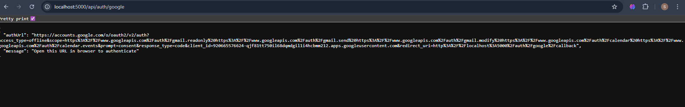

# 🔐 Google Authentication Guide

## Why You're Seeing Mock Data (John Doe)

Your Vezora AI is **working perfectly**! You're seeing mock emails (John Doe, Jane Smith) because **you haven't authenticated with Google yet**.

---

## ✅ How to Fix It (Get REAL Emails)

### **Option 1: Use the Beautiful Auth Page (RECOMMENDED)** 🎨

1. **Open in your browser:**
   ```
   http://localhost:5000/auth-test.html
   ```

2. **Click "Connect Google Account"**

3. **Google will ask for permissions:**
   - Read your Gmail
   - Send emails
   - Access Calendar

4. **Click "Allow"**

5. **Done!** You'll be redirected back and see your REAL emails!

---

### **Option 2: Direct API Method** 🔧

1. **Visit:**
   ```
   http://localhost:5000/api/auth/google
   ```

2. **Copy the `authUrl` from the JSON response**

3. **Paste it in your browser**

4. **Click "Allow" on Google's consent screen**

5. **You'll be redirected back automatically**

---

## 🧪 Test That It Worked

### **Method 1: Check Auth Status**
```
http://localhost:5000/api/auth/status
```

Should return:
```json
{
  "authenticated": true,
  "message": "Authenticated"
}
```

### **Method 2: Fetch Real Emails**
```
http://localhost:5000/api/gmail/messages
```

Should return YOUR actual Gmail emails (no more John Doe!)

---

## 🤖 Use in Vezora Chat

Once authenticated, ask Vezora:
- ✉️ "Check my emails"
- ✉️ "What's in my inbox?"
- ✉️ "Do I have any new emails?"
- ✉️ "Show me recent emails"

**You'll now see YOUR REAL emails, not mock data!**

---

## 🔍 What Changed?

### Before Authentication:
```json
{
  "authenticated": false,
  "mockData": [
    {
      "from": "John Doe <johndoe@example.com>",
      "subject": "Meeting Reminder - 3PM Today",
      "isMock": true
    }
  ]
}
```

### After Authentication:
```json
{
  "authenticated": true,
  "emails": [
    {
      "from": "your-real-contact@gmail.com",
      "subject": "Your actual email subject",
      "date": "2026-02-05T...",
      "snippet": "Your real email content...",
      "isUnread": true
    }
  ]
}
```

---

## 🚨 Troubleshooting

### "Redirect URI mismatch" Error

**Problem:** Google Cloud Console redirect URI doesn't match

**Solution:** Make sure your Google Cloud Console OAuth credentials have:
```
Authorized redirect URIs:
http://localhost:5000/auth/google/callback
```

---

### "Access blocked: This app hasn't been verified"

**Don't worry!** This is normal for development.

**Solution:** Click "Advanced" → "Go to Vezora (unsafe)"

This is YOUR app running on YOUR computer, so it's safe!

---

### Still Seeing Mock Data After Auth

**Check if you're authenticated:**
```
http://localhost:5000/api/auth/status
```

**If `authenticated: true`, clear your browser cache and try again**

---

## 📂 Where Are Tokens Stored?

Your Google auth tokens are saved securely at:
```
backend/data/google-tokens.json
```

**This file contains:**
- Access token (short-lived)
- Refresh token (long-lived)
- Token expiry time

**This file is in `.gitignore` - it will NEVER be committed to Git!** 🔒

---

## 🔓 How to Logout

### Method 1: Via API
```bash
curl -X POST http://localhost:5000/api/auth/logout
```

### Method 2: Via Auth Test Page
1. Go to `http://localhost:5000/auth-test.html`
2. Click "Logout"

### Method 3: Delete Tokens Manually
```bash
del backend\data\google-tokens.json
```

---

## 🎉 Next Steps

Once authenticated, you can:

1. ✉️ **Read emails** - "Show me my emails"
2. 📧 **Send emails** - "Send an email to john@example.com"
3. 🔍 **Search emails** - "Search for emails about project"
4. 📅 **Check calendar** - "What's on my calendar today?"
5. 📝 **Create events** - "Add meeting to calendar tomorrow at 3pm"

---

## 🔐 Security Notes

✅ **Your credentials are safe:**
- Tokens stored locally on YOUR machine
- Never sent to any third party
- Protected by `.gitignore`
- Uses Google's official OAuth 2.0 flow

✅ **You can revoke access anytime:**
- Visit [Google Account Permissions](https://myaccount.google.com/permissions)
- Find "Vezora"
- Click "Remove Access"

---

## 📞 Support

If you're still seeing mock data after authentication:

1. **Check backend logs** in terminal
2. **Verify Google Cloud Console** settings
3. **Test auth status** endpoint
4. **Check** `backend/data/google-tokens.json` exists

---

**Ready to authenticate?** 🚀

👉 **[Open Authentication Page](http://localhost:5000/auth-test.html)**

---

**Made with ❤️ by Vezora AI Team**
